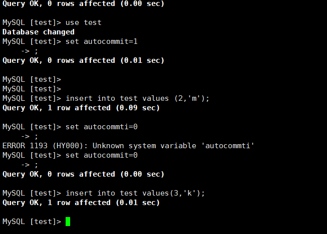
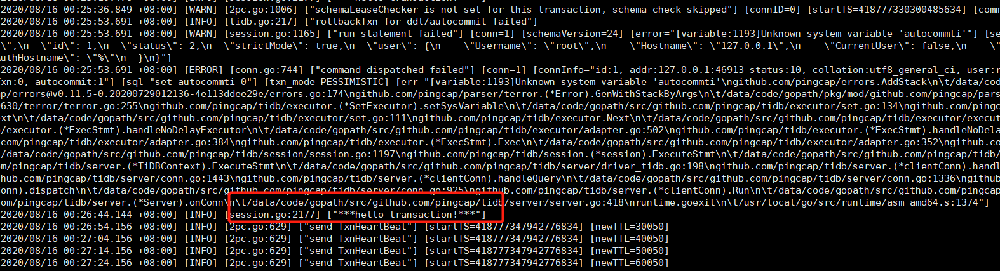

# 写在前面

第一次作业的总体要求很简单，集群部署，对源码进行简单修改，实现日志里类似hello world输出。但是细细品，其背后是一系列的技能要求，需要了解Linux或者macOS下Golang，Rust环境配置、TiDB三件套的基本概念，以及二进制部署的相关参数。由于是单机多实例部署，TikV的参数也需要进行修改，不能使用默认值。为了修改源码，还需要熟悉Golang基本概念、了解TiDB下SQL的执行流程，基本代码review能力。另外还可能涉及总之，第一次作业题目看似轻描淡写，实则暗藏不少玄机。

# 编译环境准备

## Go

下载新版的Golang即可，配置Golang编译主要问题，就是某些包下载慢或者被墙，可以配置国内proxy进行提，速。

```
tar -C /usr/local/ -zxvf go1.15.linux-amd64.tar.gz
```

设置环境变量

```
export GOROOT=/usr/local/go
export GOPATH=/data/code/gopath
export GOBIN=$GOPATH/bin
export PATH=$PATH:$GOROOT/bin
export PATH=$PATH:$GOPATH/bin
```

执行go version进行验证

```
go version go1.15 linux/amd64
```


## Cargo安装配置

Cargo 是 [Rust](https://www.rust-lang.org/) 的 *包管理工具*。对Rust不熟，直接参考官方文档，一步步执行即可。

```
curl -sSf https://static.rust-lang.org/rustup.sh | sh

curl https://sh.rustup.rs -sSf | sh

1) Proceed with installation (default)
2) Customize installation
3) Cancel installation
>1
info: profile set to 'default'
info: default host triple is x86_64-unknown-linux-gnu
info: syncing channel updates for 'stable-x86_64-unknown-linux-gnu'
info: latest update on 2020-08-03, rust version 1.45.2 (d3fb005a3 2020-07-31)
info: downloading component 'cargo'
info: downloading component 'clippy'
info: downloading component 'rust-docs'
info: downloading component 'rust-std'
info: downloading component 'rustc'
 47.1 MiB /  47.1 MiB (100 %)  18.9 MiB/s in  3s ETA:  0s
info: downloading component 'rustfmt'
info: installing component 'cargo'
info: Defaulting to 500.0 MiB unpack ram
info: installing component 'clippy'
info: installing component 'rust-docs'
 12.2 MiB /  12.2 MiB (100 %)   6.5 MiB/s in  1s ETA:  0s
info: installing component 'rust-std'
 15.9 MiB /  15.9 MiB (100 %)   8.4 MiB/s in  1s ETA:  0s
info: installing component 'rustc'
 47.1 MiB /  47.1 MiB (100 %)   8.9 MiB/s in  5s ETA:  0s
info: installing component 'rustfmt'
info: default toolchain set to 'stable'

  stable installed - rustc 1.45.2 (d3fb005a3 2020-07-31)


Rust is installed now. Great!

To get started you need Cargo's bin directory ($HOME/.cargo/bin) in your PATH
environment variable. Next time you log in this will be done
automatically.

To configure your current shell run source $HOME/.cargo/env
```


# 编译三件套

## 下载源码

```
[root@ckcentos-19653cee7 data]# cd $GOPATH
[root@ckcentos-19653cee7 gopath]# mkdir src
[root@ckcentos-19653cee7 gopath]# cd src/
[root@ckcentos-19653cee7 src]# mkdir -p github.com/pingcap
[root@ckcentos-19653cee7 src]# cd $GOPATH/src/github.com/pingcap
[root@ckcentos-19653cee7 src]# git clone https://github.com/pingcap/tidb
[root@ckcentos-19653cee7 src]# git clone https://github.com/pingcap/pd
[root@ckcentos-19653cee7 src]# git clone https://github.com/pingcap/tikv
```

## 编译TiDB

TiDB的编译非常简单，执行gmake，然后等待下载依赖包。

```
[root@ckcentos-19653cee7 pd]# gmake
CGO_ENABLED=1 GO111MODULE=on go build  -tags codes  -ldflags '-X "github.com/pingcap/parser/mysql.TiDBReleaseVersion=v4.0.0-beta.2-952-g0448a54" -X "github.com/pingcap/tidb/util/versioninfo.TiDBBuildTS=2020-08-13 12:05:59" -X "github.com/pingcap/tidb/util/versioninfo.TiDBGitHash=0448a548751931dac86ddcc557e83187eeb3a395" -X "github.com/pingcap/tidb/util/versioninfo.TiDBGitBranch=master" -X "github.com/pingcap/tidb/util/versioninfo.TiDBEdition=Community" ' -o bin/tidb-server tidb-server/main.go
go: downloading github.com/pingcap/log v0.0.0-20200511115504-543df19646ad

...
go: downloading github.com/jonboulle/clockwork v0.1.0
go: downloading github.com/dustin/go-humanize v1.0.0
go: downloading github.com/xiang90/probing v0.0.0-20190116061207-43a291ad63a2
go: downloading golang.org/x/crypto v0.0.0-20200204104054-c9f3fb736b72
go: downloading github.com/dgrijalva/jwt-go v3.2.0+incompatible
go: downloading github.com/jmespath/go-jmespath v0.3.0
Build TiDB Server successfully!\
[root@ckcentos-19653cee7 pingcap]# cd tidb/bin
[root@ckcentos-19653cee7 bin]# ls -rlt
total 158632
-rwxr-xr-x 1 root root 162435528 Aug 13 20:07 tidb-server

```

## 编译pd

```
golangci/golangci-lint info checking GitHub for tag 'v1.27.0'
golangci/golangci-lint info found version: 1.27.0 for v1.27.0/linux/amd64
golangci/golangci-lint info installed /data/code/gopath/src/github.com/pingcap/pd/.tools/bin/golangci-lint
go: downloading github.com/mgechev/revive v1.0.2
go: downloading github.com/swaggo/swag v1.6.6-0.20200529100950-7c765ddd0476
go: downloading github.com/pingcap/failpoint v0.0.0-20191029060244-12f4ac2fd11d
...
CGO_ENABLED=1 go build  -gcflags '' -ldflags '-X "github.com/pingcap/pd/v4/server/versioninfo.PDReleaseVersion=v4.0.0-rc.2-138-gbde92c6" -X "github.com/pingcap/pd/v4/server/versioninfo.PDBuildTS=2020-08-13 12:13:31" -X "github.com/pingcap/pd/v4/server/versioninfo.PDGitHash=bde92c6b6d094fa26b84481a36949faf8eae94dc" -X "github.com/pingcap/pd/v4/server/versioninfo.PDGitBranch=master" -X "github.com/pingcap/pd/v4/server/versioninfo.PDEdition=Community" -X "github.com/pingcap-incubator/tidb-dashboard/pkg/utils/version.InternalVersion=2020.08.07.1" -X "github.com/pingcap-incubator/tidb-dashboard/pkg/utils/version.Standalone=No" -X "github.com/pingcap-incubator/tidb-dashboard/pkg/utils/version.PDVersion=v4.0.0-rc.2-138-gbde92c6" -X "github.com/pingcap-incubator/tidb-dashboard/pkg/utils/version.BuildTime=2020-08-13 12:13:31" -X "github.com/pingcap-incubator/tidb-dashboard/pkg/utils/version.BuildGitHash=01f0abe88e93"' -tags " swagger_server" -o bin/pd-server cmd/pd-server/main.go

[root@ckcentos-19653cee7 bin]# ls -lrt
total 173280
-rwxr-xr-x 1 root root 118977664 Aug 13 20:14 pd-server
-rwxr-xr-x 1 root root  29546350 Aug 13 20:14 pd-ctl
-rwxr-xr-x 1 root root  28903050 Aug 13 20:14 pd-recover
```

## 编译TiKV

```
[root@ckcentos-19653cee7 pingcap]# cd tikv/
[root@ckcentos-19653cee7 tikv]# cargo build

error: failed to run custom build command for `snappy-sys v0.1.0 (https://github.com/busyjay/rust-snappy.git?branch=static-link#8c12738b)`

Caused by:
  process didn't exit successfully: `/data/code/gopath/src/github.com/pingcap/tikv/target/debug/build/snappy-sys-a9509c4a1fbdf6a4/build-script-build` (exit code: 101)
--- stdout
running: "cmake" "/root/.cargo/git/checkouts/rust-snappy-0ed33e4b7b96fc57/8c12738/snappy-sys/snappy" "-DCMAKE_INSTALL_PREFIX=/data/code/gopath/src/github.com/pingcap/tikv/target/debug/build/snappy-sys-1dddba45d27d0d80/out" "-DCMAKE_C_FLAGS= -ffunction-sections -fdata-sections -fPIC -m64" "-DCMAKE_C_COMPILER=/usr/local/bin/cc" "-DCMAKE_CXX_FLAGS= -ffunction-sections -fdata-sections -fPIC -m64" "-DCMAKE_CXX_COMPILER=/usr/local/bin/c++" "-DCMAKE_BUILD_TYPE=Debug"

--- stderr
thread 'main' panicked at '
failed to execute command: No such file or directory (os error 2)
is `cmake` not installed?

build script failed, must exit now', /root/.cargo/registry/src/github.com-1ecc6299db9ec823/cmake-0.1.42/src/lib.rs:861:5
note: run with `RUST_BACKTRACE=1` environment variable to display a backtrace

warning: build failed, waiting for other jobs to finish...
error: build failed


[root@ckcentos-19653cee7 debug]# ls -lrt
total 837540
drwxr-xr-x   2 root root      4096 Aug 13 20:25 examples
drwxr-xr-x 146 root root     12288 Aug 13 20:25 build
-rw-r--r--   2 root root 102780800 Aug 13 20:37 libcmd.rlib
drwxr-xr-x  39 root root      4096 Aug 13 20:37 incremental
-rwxr-xr-x   2 root root 317965312 Aug 13 20:38 tikv-ctl
-rwxr-xr-x   2 root root 436623960 Aug 13 20:38 tikv-server
drwxr-xr-x   2 root root     73728 Aug 13 20:38 deps
-rw-r--r--   1 root root     50313 Aug 13 20:38 tikv-ctl.d
-rw-r--r--   1 root root     50319 Aug 13 20:38 tikv-server.d
-rw-r--r--   1 root root     50246 Aug 13 20:38 libcmd.d
```

rust的编译在三个步骤里最为耗时。编译过程中还遇到个小插曲，机器上之前安装了cmake3，没有进行重命名为cmake，所以编译TiKV时报错文件找不到，对cmake3做一个软链接即可。


# 部署

三件套的部署有先后依赖顺序，依次按照pd-tikv-tidb顺序启动，否则会报错。

## 启动pd

```
[root@ckcentos-19653cee7 tidb_2379]# mkdir pd_data
[root@ckcentos-19653cee7 tidb_2379]# pd-server --name=pd1 --data-dir=pd_data --client-urls="http://127.0.0.1:2379" --peer-urls="http://127.0.0.1:2380" --initial-cluster="pd1=http://127.0.0.1:2380" --log-file=pd1.log
```

## 启动TiKV

由于是在单机上部署多个TiKV实例，这里的addr端口号需要进行区分，数据和日志目录也应不同。

```
[root@ckcentos-19653cee7 tidb_2379]# mkdir tikv1 tikv2 tikv3
[root@ckcentos-19653cee7 tidb_2379]# tikv-server --pd-endpoints="127.0.0.1:2379" \
                --addr="127.0.0.1:20160" \
                --data-dir=tikv1 \
                --log-file=tikv1.log &
[root@ckcentos-19653cee7 tidb_2379]# tikv-server --pd-endpoints="127.0.0.1:2379" \
                --addr="127.0.0.1:20161" \
                --data-dir=tikv2 \
                --log-file=tikv2.log &             
[root@ckcentos-19653cee7 tidb_2379]# tikv-server --pd-endpoints="127.0.0.1:2379" \
                --addr="127.0.0.1:20162" \
                --data-dir=tikv3 \
                --log-file=tikv3.log  &              
```


## 启动TiDB

```
[root@ckcentos-19653cee7 tidb_2379]# tidb-server --store=tikv --path='127.0.0.1:2379' --log-file=tidb.log &
```

## 集群验证

集群部署好后，查看各组件输出日志是否有报错，并通过mysql客户端连接到tidb服务进行简单读写验证。

```
[root@ckcentos-19653cee7 tidb_2379]# mysql -h 127.0.0.1 -uroot -P4000
Welcome to the MariaDB monitor.  Commands end with ; or \g.
Your MySQL connection id is 2
Server version: 5.7.25-TiDB-v4.0.0-beta.2-952-g0448a54 TiDB Server (Apache License 2.0) Community Edition, MySQL 5.7 compatible

Copyright (c) 2000, 2017, Oracle, MariaDB Corporation Ab and others.

Type 'help;' or '\h' for help. Type '\c' to clear the current input statement.

MySQL [(none)]> create database test
    -> ;
ERROR 1007 (HY000): Can't create database 'test'; database exists
MySQL [(none)]> show databases;
+--------------------+
| Database           |
+--------------------+
| INFORMATION_SCHEMA |
| METRICS_SCHEMA     |
| PERFORMANCE_SCHEMA |
| mysql              |
| test               |
+--------------------+
5 rows in set (0.00 sec)

MySQL [(none)]> use test
Database changed
MySQL [test]> create table test(id int, name char)
    -> ;
Query OK, 0 rows affected (0.20 sec)

MySQL [test]> insert into test values(1,'l');
Query OK, 1 row affected (0.03 sec)

MySQL [test]> select * from test
    -> ;
+------+------+
| id   | name |
+------+------+
|    1 | l    |
+------+------+
1 row in set (0.00 sec)

```

成功建表、写入数据。

# 源码修改

读代码过程中发现，TiDB服务启动时会判断是否使用tikv作为store，源码如下：

```
func registerStores() {
   err := session.RegisterStore("tikv", tikv.Driver{})
   terror.MustNil(err)
   tikv.NewGCHandlerFunc = gcworker.NewGCWorker
   err = session.RegisterStore("mocktikv", mockstore.MockDriver{})
   terror.MustNil(err)
}
```

如果不显示指定，则使用mocktikv，因此如果只是本地调试使用，可以不需要部署tikv和pd。

按照SQL执行顺序，慢慢查找代码，可以定位到事务创建入口。此外还有个简单的方法，就是取消自动commit后，手动执行BEGIN，会打印个日志，根据日志Info可以快速定位到session/session.go里的NewTxn方法，这里应该事务真正启动的入口了。

源码修改:

```go
func (s *session) NewTxn(ctx context.Context) error {
        if s.txn.Valid() {
                txnID := s.txn.StartTS()
                err := s.CommitTxn(ctx)
                if err != nil {
                        return err
                }
                vars := s.GetSessionVars()
                logutil.BgLogger().Info("***hello transaction!***")  // 进行修改
                logutil.Logger(ctx).Info("NewTxn() inside a transaction auto commit",
                        zap.Int64("schemaVersion", vars.TxnCtx.SchemaVersion),
                        zap.Uint64("txnStartTS", txnID))
        }
...
```

源码修改后，对TiDB重新进行编译部署。主要如果要优雅关闭集群，应该遵循tidb-tikv-pd的先后顺序。

## 验证

tidb服务重新部署后，手动执行个BEGIN命令（先关闭auto commit），查看后台日志，发现hello transaction成功输出。






# 参考资料

* 《TiDB 源码阅读之 Transaction》https://www.bilibili.com/video/BV1ox411R7EA?from=search&seid=3657208026997558413

* https://learnku.com/docs/cargo-book/2018/translation-notes/4785

* 《CMake安装》 https://www.24kplus.com/linux/557.html