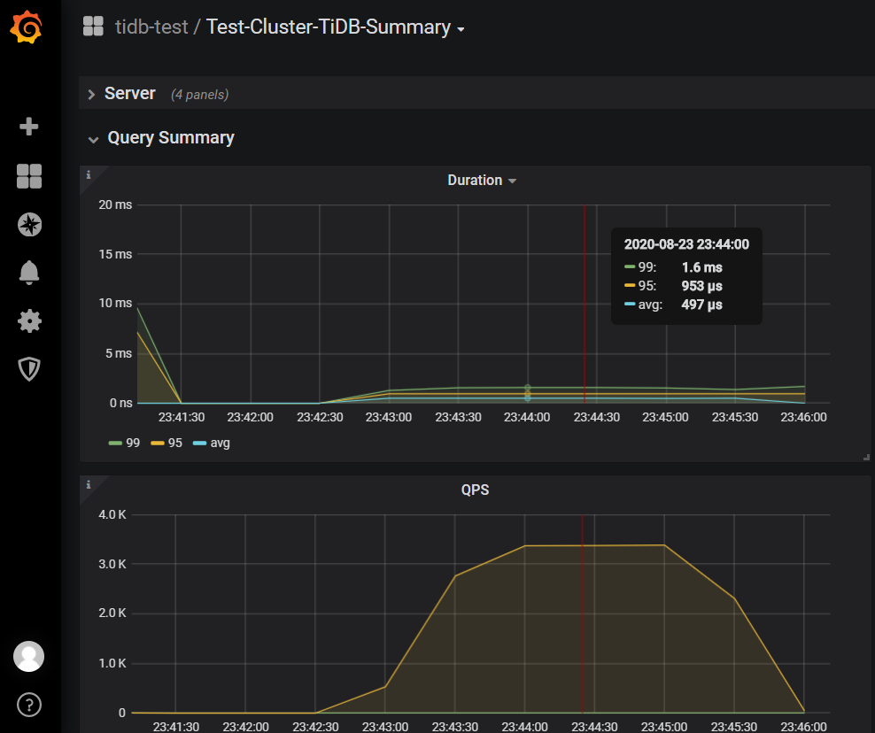
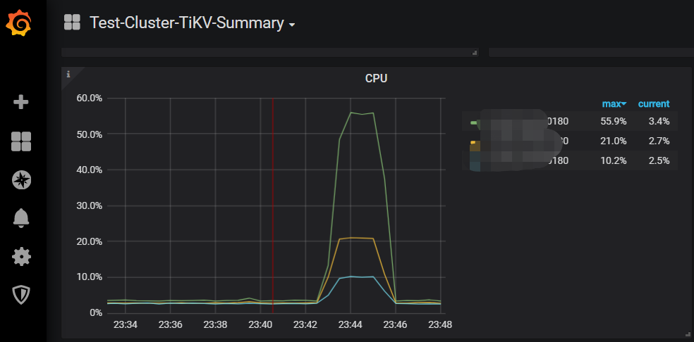
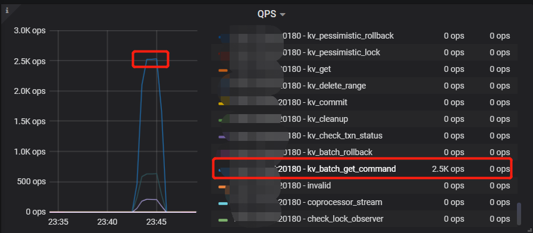
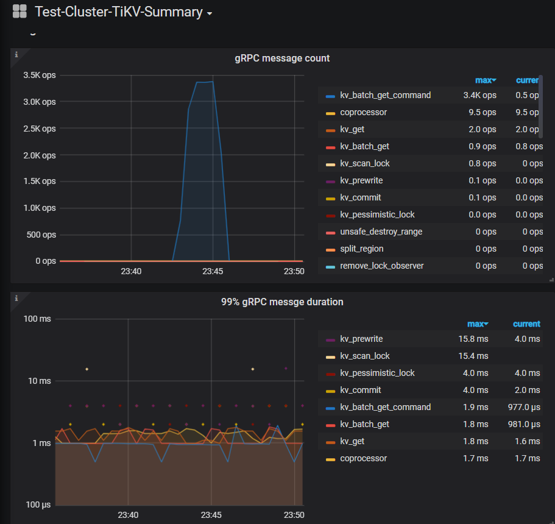
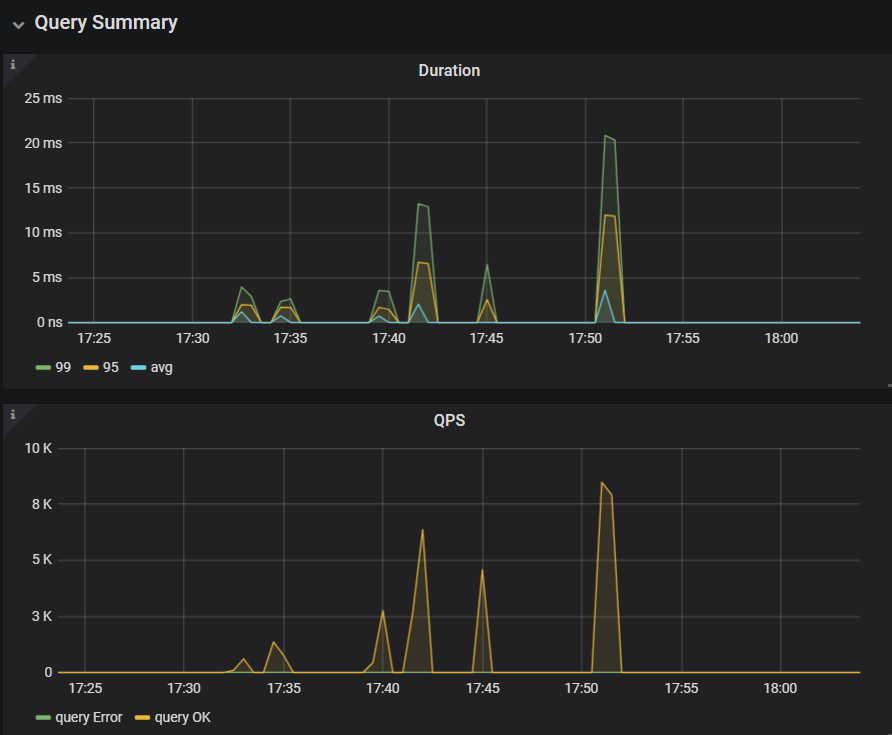
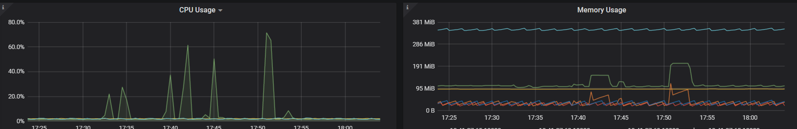
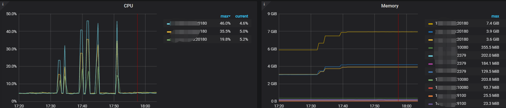
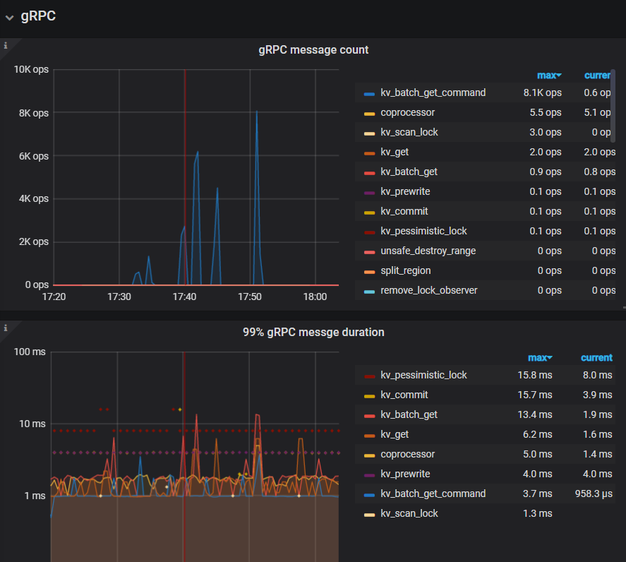
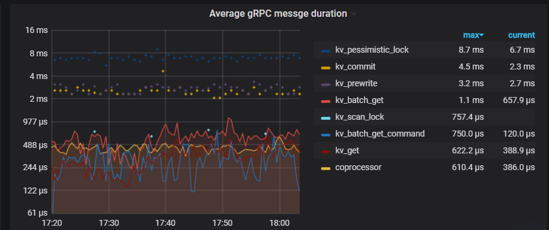
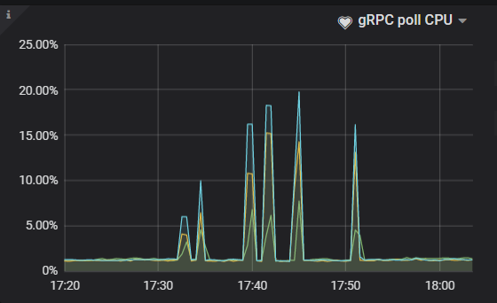

#  

## 写在前面

此次体验了一把使用TiUP部署TiDB集群，几个字总结：一键式、快速、直观。但是还是提两个使用中的小建议：

1. 部署时可以实时检端口冲突，而不是通过肉眼检查，在console实时输出冲突检测。目标机器上N久之前部署过一套etcd集群，默认端口2379。等start集群后才发现这个端口被占用了，导致pd通信报错，只能删除集群，重新部署
2. destory集群时，不能单纯通过端口号如2379，来判断对tidb服务进程进行删除，这个端口万一是其他进程监听的呢（如etcd），会发现删不掉

## 使用TiUP部署TiDB集群

### 机器配置&集群拓扑

由于脱敏考虑，对机器名使用了别名。自己测试环境资源有限，只能选择在单机上多角色部署了。

| 机器名 | CPU  | 内存 | 磁盘 | 节点角色                |
| ------ | ---- | ---- | ---- | ----------------------- |
| ip1    | 4C   | 16G  | SSD  | pd,tidb,tikv            |
| ip2    | 4C   | 16G  | SSD  | pd,tidb,tikv            |
| ip3    | 4C   | 16G  | SSD  | pd,tidb,tikv            |
| ip4    | 4C   | 16G  | SSD  | sysbench/go-ycsb/go-tpc |

### 集群部署

```
# tiup cluster deploy tidb-test v4.0.0 ./topology.yaml --user root
...
Deployed cluster `tidb-test` successfully, you can start the cluster via `tiup cluster start tidb-test`

```

### 集群启动

```
# tiup cluster start tidb-test
...
Started cluster `tidb-test` successfully

```


## 测试

本文分别对sysbench/go-ycsb/to-tpc进行了部署及测试。使用下来，sysbench的测试报告输出更加友好，因此将着重使用sysbench进行测试对比分析，其他两个工具仅做简单体验。

### 测试工具

#### sysbench

* 数据铺底

```shell
sysbench --config-file=config oltp_point_select --tables=16--table-size=100000 prepare
```

* 测试

```shell
sysbench --config-file=config  oltp_point_select --tables=16 --table-size=100000 run
sysbench 1.0.14 (using bundled LuaJIT 2.1.0-beta2)

Running the test with following options:
Number of threads: 8
Report intermediate results every 10 second(s)
Initializing random number generator from current time


Initializing worker threads...

Threads started!

[ 10s ] thds: 8 tps: 3342.69 qps: 3342.69 (r/w/o: 3342.69/0.00/0.00) lat (ms,95%): 2.81 err/s: 0.00 reconn/s: 0.00
[ 20s ] thds: 8 tps: 3369.96 qps: 3369.96 (r/w/o: 3369.96/0.00/0.00) lat (ms,95%): 2.76 err/s: 0.00 reconn/s: 0.00
[ 30s ] thds: 8 tps: 3345.28 qps: 3345.28 (r/w/o: 3345.28/0.00/0.00) lat (ms,95%): 2.76 err/s: 0.00 reconn/s: 0.00
[ 40s ] thds: 8 tps: 3353.80 qps: 3353.80 (r/w/o: 3353.80/0.00/0.00) lat (ms,95%): 2.76 err/s: 0.00 reconn/s: 0.00
[ 50s ] thds: 8 tps: 3347.60 qps: 3347.60 (r/w/o: 3347.60/0.00/0.00) lat (ms,95%): 2.76 err/s: 0.00 reconn/s: 0.00
[ 60s ] thds: 8 tps: 3364.10 qps: 3364.10 (r/w/o: 3364.10/0.00/0.00) lat (ms,95%): 2.76 err/s: 0.00 reconn/s: 0.00
[ 70s ] thds: 8 tps: 3374.70 qps: 3374.70 (r/w/o: 3374.70/0.00/0.00) lat (ms,95%): 2.76 err/s: 0.00 reconn/s: 0.00
[ 80s ] thds: 8 tps: 3378.58 qps: 3378.58 (r/w/o: 3378.58/0.00/0.00) lat (ms,95%): 2.71 err/s: 0.00 reconn/s: 0.00
[ 90s ] thds: 8 tps: 3381.31 qps: 3381.31 (r/w/o: 3381.31/0.00/0.00) lat (ms,95%): 2.71 err/s: 0.00 reconn/s: 0.00
[ 100s ] thds: 8 tps: 3343.20 qps: 3343.20 (r/w/o: 3343.20/0.00/0.00) lat (ms,95%): 2.76 err/s: 0.00 reconn/s: 0.00
[ 110s ] thds: 8 tps: 3324.90 qps: 3324.90 (r/w/o: 3324.90/0.00/0.00) lat (ms,95%): 2.81 err/s: 0.00 reconn/s: 0.00
[ 120s ] thds: 8 tps: 3361.79 qps: 3361.79 (r/w/o: 3361.79/0.00/0.00) lat (ms,95%): 2.76 err/s: 0.00 reconn/s: 0.00
SQL statistics:
    queries performed:
        read:                            402895
        write:                           0
        other:                           0
        total:                           402895
    transactions:                        402895 (3357.33 per sec.)
    queries:                             402895 (3357.33 per sec.)
    ignored errors:                      0      (0.00 per sec.)
    reconnects:                          0      (0.00 per sec.)

General statistics:
    total time:                          120.0029s
    total number of events:              402895

Latency (ms):
         min:                                    1.81
         avg:                                    2.38
         max:                                   18.26
         95th percentile:                        2.76
         sum:                               959205.88

Threads fairness:
    events (avg/stddev):           50361.8750/2292.90
    execution time (avg/stddev):   119.9007/0.01

```

* Grafana截图









#### go-ycsb

```
# go-ycsb load mysql -P workloads/workloada -p recordcount=10000 -p mysql.host=ip1 -p mysql.port=4000 -p mysql.user=test -p mysql.password=test123 -p mysql.db=yctest --threads 16
 
Run finished, takes 517.175465ms
READ   - Takes(s): 0.5, Count: 510, OPS: 1011.2, Avg(us): 3518, Min(us): 2461, Max(us): 12776, 99th(us): 11000, 99.9th(us): 13000, 99.99th(us): 13000
UPDATE - Takes(s): 0.5, Count: 482, OPS: 975.1, Avg(us): 11138, Min(us): 7298, Max(us): 20141, 99th(us): 20000, 99.9th(us): 21000, 99.99th(us): 21000

```

#### go-tpc

```
# go-tpc tpcc -H 10.41.27.69 -P 4000 -D tptest -U test -p test123 --warehouses 8 run --time 2m --threads 16
DELIVERY - Takes(s): 9.5, Count: 65, TPM: 410.3, Sum(ms): 17729, Avg(ms): 272, 95th(ms): 512, 99th(ms): 1000, 99.9th(ms): 1000
NEW_ORDER - Takes(s): 9.7, Count: 691, TPM: 4274.7, Sum(ms): 77505, Avg(ms): 112, 95th(ms): 192, 99th(ms): 256, 99.9th(ms): 512
ORDER_STATUS - Takes(s): 9.7, Count: 65, TPM: 402.7, Sum(ms): 1528, Avg(ms): 23, 95th(ms): 32, 99th(ms): 40, 99.9th(ms): 40
PAYMENT - Takes(s): 9.7, Count: 654, TPM: 4030.0, Sum(ms): 57213, Avg(ms): 87, 95th(ms): 192, 99th(ms): 256, 99.9th(ms): 256
STOCK_LEVEL - Takes(s): 9.8, Count: 61, TPM: 374.8, Sum(ms): 1832, Avg(ms): 30, 95th(ms): 64, 99th(ms): 80, 99.9th(ms): 80
DELIVERY - Takes(s): 19.5, Count: 137, TPM: 421.4, Sum(ms): 40291, Avg(ms): 294, 95th(ms): 512, 99th(ms): 1000, 99.9th(ms): 1000
NEW_ORDER - Takes(s): 19.7, Count: 1402, TPM: 4270.3, Sum(ms): 154412, Avg(ms): 110, 95th(ms): 192, 99th(ms): 256, 99.9th(ms): 512
ORDER_STATUS - Takes(s): 19.7, Count: 112, TPM: 341.4, Sum(ms): 2584, Avg(ms): 23, 95th(ms): 40, 99th(ms): 40, 99.9th(ms): 64
PAYMENT - Takes(s): 19.7, Count: 1311, TPM: 3985.5, Sum(ms): 114281, Avg(ms): 87, 95th(ms): 192, 99th(ms): 256, 99.9th(ms): 512
STOCK_LEVEL - Takes(s): 19.8, Count: 114, TPM: 346.0, Sum(ms): 3136, Avg(ms): 27, 95th(ms): 48, 99th(ms): 64, 99.9th(ms): 80
DELIVERY - Takes(s): 29.5, Count: 200, TPM: 406.7, Sum(ms): 57705, Avg(ms): 288, 95th(ms): 512, 99th(ms): 1000, 99.9th(ms): 1000
NEW_ORDER - Takes(s): 29.7, Count: 2093, TPM: 4228.4, Sum(ms): 229608, Avg(ms): 109, 95th(ms): 192, 99th(ms): 256, 99.9th(ms): 512
ORDER_STATUS - Takes(s): 29.7, Count: 172, TPM: 347.7, Sum(ms): 3926, Avg(ms): 22, 95th(ms): 40, 99th(ms): 64, 99.9th(ms): 64
PAYMENT - Takes(s): 29.7, Count: 2050, TPM: 4136.3, Sum(ms): 178003, Avg(ms): 86, 95th(ms): 192, 99th(ms): 256, 99.9th(ms): 512
STOCK_LEVEL - Takes(s): 29.8, Count: 180, TPM: 362.8, Sum(ms): 4685, Avg(ms): 26, 95th(ms): 48, 99th(ms): 64, 99.9th(ms): 80
DELIVERY - Takes(s): 39.5, Count: 250, TPM: 379.7, Sum(ms): 72980, Avg(ms): 291, 95th(ms): 512, 99th(ms): 1000, 99.9th(ms): 1000
NEW_ORDER - Takes(s): 39.7, Count: 2800, TPM: 4231.9, Sum(ms): 309525, Avg(ms): 110, 95th(ms): 192, 99th(ms): 256, 99.9th(ms): 512
ORDER_STATUS - Takes(s): 39.7, Count: 236, TPM: 356.8, Sum(ms): 5388, Avg(ms): 22, 95th(ms): 40, 99th(ms): 48, 99.9th(ms): 64
PAYMENT - Takes(s): 39.7, Count: 2719, TPM: 4105.5, Sum(ms): 238947, Avg(ms): 87, 95th(ms): 192, 99th(ms): 256, 99.9th(ms): 512
STOCK_LEVEL - Takes(s): 39.8, Count: 234, TPM: 353.1, Sum(ms): 6025, Avg(ms): 25, 95th(ms): 48, 99th(ms): 64, 99.9th(ms): 80
DELIVERY - Takes(s): 49.5, Count: 311, TPM: 376.9, Sum(ms): 91983, Avg(ms): 295, 95th(ms): 1000, 99th(ms): 1000, 99.9th(ms): 1000
NEW_ORDER - Takes(s): 49.7, Count: 3489, TPM: 4212.1, Sum(ms): 388493, Avg(ms): 111, 95th(ms): 192, 99th(ms): 256, 99.9th(ms): 512
ORDER_STATUS - Takes(s): 49.7, Count: 295, TPM: 356.2, Sum(ms): 6773, Avg(ms): 22, 95th(ms): 40, 99th(ms): 48, 99.9th(ms): 64
PAYMENT - Takes(s): 49.7, Count: 3385, TPM: 4083.4, Sum(ms): 297230, Avg(ms): 87, 95th(ms): 192, 99th(ms): 256, 99.9th(ms): 512
STOCK_LEVEL - Takes(s): 49.8, Count: 295, TPM: 355.7, Sum(ms): 7715, Avg(ms): 26, 95th(ms): 48, 99th(ms): 64, 99.9th(ms): 80
DELIVERY - Takes(s): 59.5, Count: 364, TPM: 367.0, Sum(ms): 106881, Avg(ms): 293, 95th(ms): 512, 99th(ms): 1000, 99.9th(ms): 1000
NEW_ORDER - Takes(s): 59.7, Count: 4203, TPM: 4224.2, Sum(ms): 469982, Avg(ms): 111, 95th(ms): 192, 99th(ms): 256, 99.9th(ms): 512
ORDER_STATUS - Takes(s): 59.7, Count: 367, TPM: 368.9, Sum(ms): 8407, Avg(ms): 22, 95th(ms): 40, 99th(ms): 48, 99.9th(ms): 64
PAYMENT - Takes(s): 59.7, Count: 4058, TPM: 4075.9, Sum(ms): 356882, Avg(ms): 87, 95th(ms): 192, 99th(ms): 256, 99.9th(ms): 512
STOCK_LEVEL - Takes(s): 59.8, Count: 358, TPM: 359.4, Sum(ms): 9284, Avg(ms): 25, 95th(ms): 48, 99th(ms): 64, 99.9th(ms): 80
DELIVERY - Takes(s): 69.5, Count: 423, TPM: 365.1, Sum(ms): 123314, Avg(ms): 291, 95th(ms): 512, 99th(ms): 1000, 99.9th(ms): 1000
NEW_ORDER - Takes(s): 69.7, Count: 4908, TPM: 4225.0, Sum(ms): 547404, Avg(ms): 111, 95th(ms): 192, 99th(ms): 256, 99.9th(ms): 512
ORDER_STATUS - Takes(s): 69.7, Count: 433, TPM: 372.8, Sum(ms): 9887, Avg(ms): 22, 95th(ms): 40, 99th(ms): 48, 99.9th(ms): 64
PAYMENT - Takes(s): 69.7, Count: 4792, TPM: 4122.9, Sum(ms): 418954, Avg(ms): 87, 95th(ms): 192, 99th(ms): 256, 99.9th(ms): 512
STOCK_LEVEL - Takes(s): 69.8, Count: 424, TPM: 364.6, Sum(ms): 10883, Avg(ms): 25, 95th(ms): 48, 99th(ms): 64, 99.9th(ms): 80
DELIVERY - Takes(s): 79.5, Count: 493, TPM: 372.0, Sum(ms): 142736, Avg(ms): 289, 95th(ms): 512, 99th(ms): 1000, 99.9th(ms): 1000
NEW_ORDER - Takes(s): 79.7, Count: 5644, TPM: 4249.0, Sum(ms): 625416, Avg(ms): 110, 95th(ms): 192, 99th(ms): 256, 99.9th(ms): 512
ORDER_STATUS - Takes(s): 79.7, Count: 496, TPM: 373.5, Sum(ms): 11290, Avg(ms): 22, 95th(ms): 40, 99th(ms): 48, 99.9th(ms): 64
PAYMENT - Takes(s): 79.7, Count: 5509, TPM: 4145.4, Sum(ms): 477993, Avg(ms): 86, 95th(ms): 192, 99th(ms): 256, 99.9th(ms): 512
STOCK_LEVEL - Takes(s): 79.8, Count: 493, TPM: 370.8, Sum(ms): 12475, Avg(ms): 25, 95th(ms): 48, 99th(ms): 64, 99.9th(ms): 80
DELIVERY - Takes(s): 89.5, Count: 561, TPM: 376.1, Sum(ms): 162830, Avg(ms): 290, 95th(ms): 512, 99th(ms): 1000, 99.9th(ms): 1000
NEW_ORDER - Takes(s): 89.7, Count: 6335, TPM: 4237.5, Sum(ms): 702307, Avg(ms): 110, 95th(ms): 192, 99th(ms): 256, 99.9th(ms): 512
ORDER_STATUS - Takes(s): 89.7, Count: 570, TPM: 381.3, Sum(ms): 12931, Avg(ms): 22, 95th(ms): 40, 99th(ms): 48, 99.9th(ms): 64
PAYMENT - Takes(s): 89.7, Count: 6191, TPM: 4139.4, Sum(ms): 537148, Avg(ms): 86, 95th(ms): 192, 99th(ms): 256, 99.9th(ms): 512
STOCK_LEVEL - Takes(s): 89.8, Count: 557, TPM: 372.3, Sum(ms): 13999, Avg(ms): 25, 95th(ms): 48, 99th(ms): 64, 99.9th(ms): 80
DELIVERY - Takes(s): 99.5, Count: 624, TPM: 376.3, Sum(ms): 182658, Avg(ms): 292, 95th(ms): 512, 99th(ms): 1000, 99.9th(ms): 1000
NEW_ORDER - Takes(s): 99.7, Count: 7045, TPM: 4239.8, Sum(ms): 784815, Avg(ms): 111, 95th(ms): 192, 99th(ms): 256, 99.9th(ms): 512
ORDER_STATUS - Takes(s): 99.7, Count: 637, TPM: 383.4, Sum(ms): 14579, Avg(ms): 22, 95th(ms): 40, 99th(ms): 48, 99.9th(ms): 64
PAYMENT - Takes(s): 99.7, Count: 6800, TPM: 4090.8, Sum(ms): 590666, Avg(ms): 86, 95th(ms): 192, 99th(ms): 256, 99.9th(ms): 512
STOCK_LEVEL - Takes(s): 99.8, Count: 615, TPM: 369.9, Sum(ms): 15533, Avg(ms): 25, 95th(ms): 48, 99th(ms): 64, 99.9th(ms): 80
DELIVERY - Takes(s): 109.5, Count: 678, TPM: 371.5, Sum(ms): 198369, Avg(ms): 292, 95th(ms): 512, 99th(ms): 1000, 99.9th(ms): 1000
NEW_ORDER - Takes(s): 109.7, Count: 7665, TPM: 4192.4, Sum(ms): 855981, Avg(ms): 111, 95th(ms): 192, 99th(ms): 256, 99.9th(ms): 512
ORDER_STATUS - Takes(s): 109.7, Count: 694, TPM: 379.6, Sum(ms): 15973, Avg(ms): 23, 95th(ms): 40, 99th(ms): 48, 99.9th(ms): 64
PAYMENT - Takes(s): 109.7, Count: 7528, TPM: 4116.0, Sum(ms): 660348, Avg(ms): 87, 95th(ms): 192, 99th(ms): 256, 99.9th(ms): 512
STOCK_LEVEL - Takes(s): 109.8, Count: 671, TPM: 366.8, Sum(ms): 17007, Avg(ms): 25, 95th(ms): 48, 99th(ms): 64, 99.9th(ms): 80
Finished
DELIVERY - Takes(s): 119.5, Count: 729, TPM: 365.9, Sum(ms): 212747, Avg(ms): 291, 95th(ms): 512, 99th(ms): 1000, 99.9th(ms): 1000
DELIVERY_ERR - Takes(s): 0.0, Count: 2, TPM: 5108.7, Sum(ms): 184, Avg(ms): 92, 95th(ms): 128, 99th(ms): 128, 99.9th(ms): 128
NEW_ORDER - Takes(s): 119.7, Count: 8358, TPM: 4188.7, Sum(ms): 935900, Avg(ms): 111, 95th(ms): 192, 99th(ms): 256, 99.9th(ms): 512
NEW_ORDER_ERR - Takes(s): 0.0, Count: 9, TPM: 22974.3, Sum(ms): 446, Avg(ms): 49, 95th(ms): 128, 99th(ms): 128, 99.9th(ms): 128
ORDER_STATUS - Takes(s): 119.7, Count: 770, TPM: 385.9, Sum(ms): 17819, Avg(ms): 23, 95th(ms): 40, 99th(ms): 48, 99.9th(ms): 64
PAYMENT - Takes(s): 119.8, Count: 8177, TPM: 4096.7, Sum(ms): 721776, Avg(ms): 88, 95th(ms): 192, 99th(ms): 256, 99.9th(ms): 512
PAYMENT_ERR - Takes(s): 0.0, Count: 3, TPM: 7684.8, Sum(ms): 269, Avg(ms): 89, 95th(ms): 256, 99th(ms): 256, 99.9th(ms): 256
STOCK_LEVEL - Takes(s): 119.8, Count: 729, TPM: 365.1, Sum(ms): 18586, Avg(ms): 25, 95th(ms): 48, 99th(ms): 64, 99.9th(ms): 96
```


### sysbench测试分析

创建了16张表，每张表100W记录，分别记录不同线程数的QPS。

| 线程数 | QPS  | 95%延迟 |
| ------ | ---- | ------- |
| 8      | 3416 | 3.49    |
| 16     | 3778 | 3.25    |
| 32     | 3844 | 3.3     |
| 64     | 3178 | 4.82    |
| 128    | 2205 | 9.22    |
| 256    | 1456 | 14.73   |

随着客户端模拟线程数增加，QPS在32线程数时到达高峰，之后不断降低，延迟也在逐渐增加，此时TiDB、TiKV 进程CPU使用率仍未饱和，磁盘IO也非常低。下图是记录的压测过程中QPS及CPU等监控图标。



TiDB CPU及内存使用



TiKV CPU及内存使用







gRPC poll CPU < 32%(4 * 80%)




## 总结

本次测试由于机器配置有限，故采用了单机多实例混部，将计算节点和存储节点放一台机器上，加上机器CPU有限，导致整体性能不尽人意。时间所限，每次测试只连接了一个节点，导致该节点的CPU负载相对较高，未能充分利用其余节点的计算能力。正常业务访问过程中，可以使用负载均衡或者同时访问多个server节点，应该能线性提高读写性能？

针对这种本身机器配置就很低的性能调优，其实方法很简单——增加机器配置，性能立竿见影。